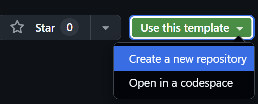
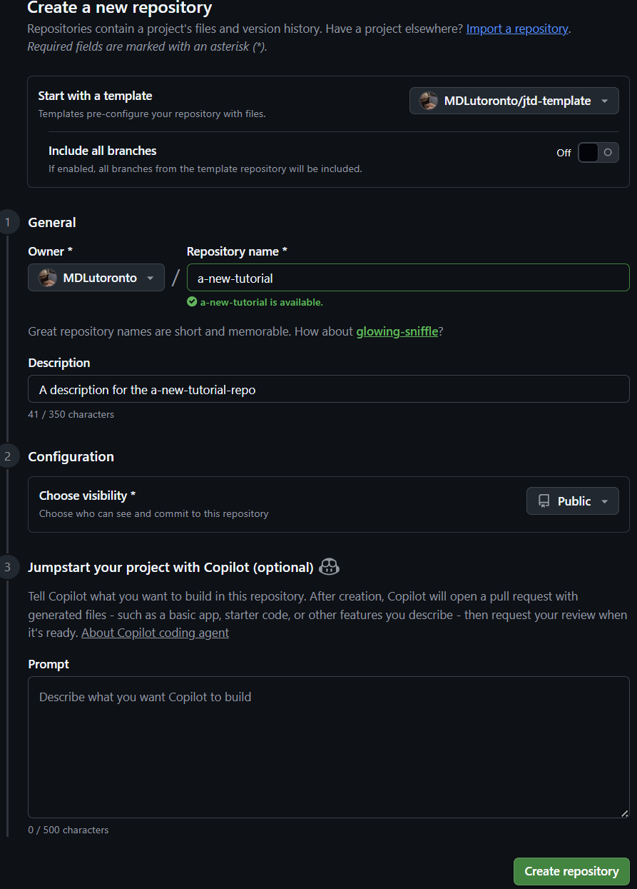
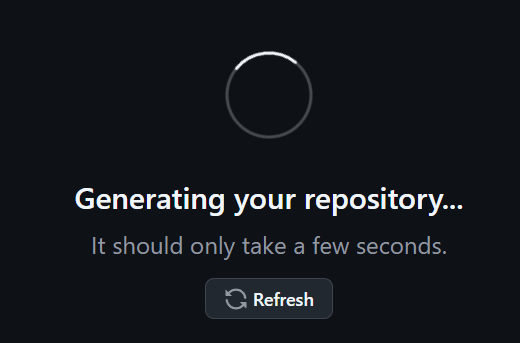
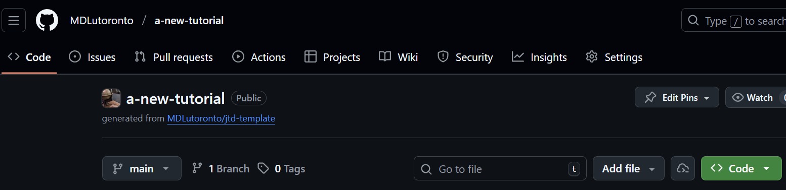
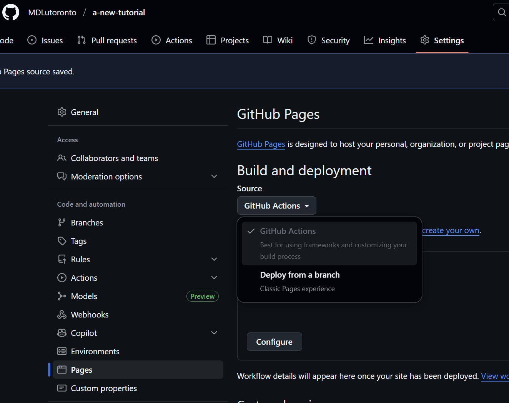
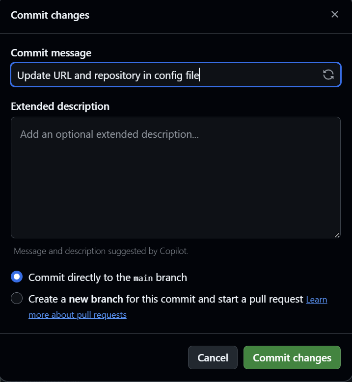

# Map and Data Library JTD template
This is a customized version of the [Just the Docs](https://just-the-docs.com) template for the [Map and Data Library](https://mdl.library.utoronto.ca) at the [University of Toronto Libraries](https://www.library.utoronto.ca).

# Using this template
To use the this repository as a template to create new just-the-docs site, follow the steps below:

## Creating a new repository
1. Click on the `Use this template` button at the top right of this repository page. Then, click on the `Create a new repository` button.

    

2. You will be prompted to enter a repository name, description, and other settings.
   1. For the owner, choose `MDLutoronto`.
   2. Enter the name (also act as the slug) for your new Just-the-docs site.
   3. Enter a description for your new repository.
   4. Choose the repository visibility (public or private).

    {: .important }
    > Note that to make the site visible to everyone, you need to choose `public` as the repository visibility eventually.

    

5. Click on the `Create repository` button on the bottom right to create your new repository.

    

6. You will be prompted to the new repository page in a few seconds.
   

   

## Enabling GitHub Pages
1. You will first need to enable GitHub Pages. Go to the `Settings` tab of your new repository. Then, click on the `Pages` option in the left sidebar.

   

## Modifying the configuration file

1. In order publish the website, you will have to modify the `_config.yml` file in your new repository, with the following modifications:
   1. First, replace the `jtd-theme` in the `url` field with the name of your new repository.
   
   For example, if your new repository is called `a-new-tutorial`, the `url` field should look like this:
   ```yaml
   url: "https://MDLutoronto.github.io/a-new-tutorial"
   ```
    
   2. Then, replace the repository: "MDLutoronto/jtd-theme" with the name of your new repository. For example, if your new repository is called `a-new-tutorial`, the `repository` field should look like this:
   ```yaml
   url: "MDLutoronto/a-new-tutorial"
   ```
   

   3. Commit the changes to the `_config.yml` file. Enter your commit message. Ensure the `Commit directly to the main branch` option is selected, then click on the `Commit changes` button.

   

You should now be able to see your new site at `https://MDLutoronto.github.io/your-repo-name` within a few minutes. For example, if your new repository is called `a-new-tutorial`, you should be able to see your new site at `https://MDLutoronto.github.io/a-new-tutorial`.
